# Decentralized Microservices Application for Real Estate Rental on Ethereum Blockchain

## Project Description

This project implements a **Decentralized Real Estate Rental Platform** based on a
**microservices architecture** and **Ethereum blockchain** technology.

The platform enables secure, transparent, and peer-to-peer rental transactions without
traditional intermediaries. Rental payments and lease execution are enforced by smart
contracts deployed on Ethereum, while backend microservices and a modern frontend
provide usability, scalability, and extensibility.

---

## Project Objectives

- Enable peer-to-peer property listing and rental using smart contracts to ensure trust, security, and automation.

- Build a scalable microservices-based backend using Spring Boot, integrated with blockchain and data services.

- Develop a modern  frontend with React for seamless user interaction between tenants and property owners.

- Integrate AI-driven analytics and machine learning models to provide dynamic rental price suggestions, tenant risk scoring, personalized property recommendations, and market trend predictions.

- Apply DevOps and cloud-native practices (Docker, Kubernetes, CI/CD, Terraform on AWS) to ensure scalability, reliability, and continuous deployment.

- Demonstrate effective collaboration between multiple engineering roles and modern full-stack, blockchain, AI, and DevOps technologies.

---

## Technologies Used

### Backend
- Spring Boot (Microservices)
- Java 17
- Web3j (Blockchain integration)
- MySQL
- RabbitMQ

### Frontend
- React

### Blockchain
- Ethereum (Sepolia Testnet)
- Solidity Smart Contracts
- Hardhat
- MetaMask

### DevOps & Cloud
- Docker & Docker Compose
- Kubernetes (planned)
- CI/CD (GitHub, Jenkins – planned)
- Monitoring (Prometheus & Grafana – planned)

### AI & Data
- Python
- FastAPI (microservice)
- Scikit-learn
- Pandas, Plotly

---

## Microservices Architecture

The platform is composed of the following microservices:

| Microservice        | Description                                       |
|--------------       |------------                                       |
| API Gateway         | Central entry point, routing requests to services |
| Auth Microservice   | Authentication and authorization                  |
| Listing Service     | Property listing management                       |
| Booking Service     | Rental booking logic                              |
| Payment Service     | Blockchain-based rental payment validation        |

---

# 🔗 Blockchain & Payment Microservice

## Role of the Blockchain Module

The blockchain module is responsible for managing **rental payments and lease execution**
in a decentralized and trustless manner.

It ensures:
- Secure handling of rental payments
- Automatic fee distribution
- Immutable transaction records
- Backend ↔ Blockchain interoperability

---

## Smart Contract Overview (Rental Escrow)

The smart contract implements a **rental escrow mechanism** involving three main actors:

### Contract Participants

- **Owner**  
  The property owner (landlord) who rents the property.

- **Tenant**  
  The renter who pays the rental amount.

- **Platform Owner**  
  The application owner who receives a commission for providing the platform.

---

### Platform Commission

- The platform takes a **5% commission** on each rental payment.
- This percentage is configurable by the platform owner.
- The commission is automatically deducted and transferred on-chain during payment.

---

## Rental Payment Workflow

1. The tenant initiates the rental payment
2. The smart contract:
    - Calculates platform commission (5%)
    - Transfers commission to the platform owner
    - Transfers remaining amount to the property owner
3. The transaction is recorded immutably on Ethereum
4. Contract state updates automatically

---

## Contract States Explanation

The smart contract follows a **state-based lifecycle** to guarantee correctness, security,
and business logic enforcement.


Created → Funded → Active → Completed
↘ Cancelled

## State Descriptions
1. Created
   Contract is deployed
   Rental parameters are defined
   No payment has been made yet
   Waiting for tenant funding

2. Funded
   Tenant has paid the rental amount
   Platform commission has been deducted
   Owner has received payment
   Contract is ready to start the lease

3. Active
   Lease period has officially started
   Rental is considered ongoing
   Disputes or refunds may be handled if required

4. Completed
   Lease period has ended
   Contract execution is finalized
   No further actions are allowed

5. Cancelled
   Contract is cancelled before lease execution
   Protects participants from invalid or aborted rentals

## Blockchain Payment Microservice

The Payment Service is a Spring Boot microservice that connects the backend
ecosystem to the Ethereum blockchain.
It does not process payments itself, but:
- Interacts with the deployed smart contract
- Verifies blockchain state
- Retrieves balances and contract information
- Exposes REST APIs for validation and testing

## Backend ↔ Blockchain Communication

**Technologies:**
Web3j
Ethereum Sepolia Testnet
Infura RPC
Docker
**Implemented validations:**
Ethereum network connectivity
Wallet balance retrieval
Smart contract state retrieval
API health verification
Successful responses confirm that blockchain integration is fully functional.


## Backend Development

(To be completed by the Backend Engineer)

## Frontend Development

# Documentation Technique - Decentralized Rental App

**Auteur:** Architecte Logiciel Senior  
**Date:** 14 janvier 2026  
**Version:** 1.0

---

## Table des Matières

1. [Vue d'ensemble du système](#1-vue-densemble-du-système)
2. [Architecture système (Macro)](#2-architecture-système-macro)
3. [Modélisation des données (ERD Global)](#3-modélisation-des-données-erd-global)
4. [Catalogue des API (Endpoints)](#4-catalogue-des-api-endpoints)
5. [Workflows critiques (Diagrammes de séquence)](#5-workflows-critiques-diagrammes-de-séquence)
6. [Sécurité et intégration](#6-sécurité-et-intégration)
7. [Communication inter-services](#7-communication-inter-services)
8. [Intégration blockchain](#8-intégration-blockchain)
9. [Gestion des états et transitions](#9-gestion-des-états-et-transitions)
10. [Patterns architecturaux](#10-patterns-architecturaux)
11. [Déploiement et infrastructure](#11-déploiement-et-infrastructure)

---

## 1. Vue d'ensemble du système

### 1.1 Description

**Decentralized Rental App** est une plateforme de location décentralisée basée sur une architecture microservices, intégrant la blockchain pour les paiements sécurisés. Le système permet aux propriétaires (Hôtes) de lister leurs biens immobiliers et aux locataires (Clients) de réserver et payer via des smart contracts Ethereum.

### 1.2 Technologies principales

- **Backend:** Spring Boot 3.x, Spring Cloud Gateway
- **Base de données:** PostgreSQL (une DB par microservice)
- **Messaging:** RabbitMQ (Event-Driven Architecture)
- **Blockchain:** Web3j, Ethereum/Polygon, Smart Contracts Solidity
- **Sécurité:** JWT, Spring Security
- **Stockage:** AWS S3 (images)

### 1.3 Principes architecturaux

- **Microservices indépendants:** Chaque service possède sa propre base de données
- **Event-Driven Architecture:** Communication asynchrone via RabbitMQ
- **API Gateway centralisée:** Point d'entrée unique pour tous les clients
- **Immutabilité des contrats:** Les données critiques (prix, wallet) sont figées lors de la création de la réservation
- **Circuit Breaker Pattern:** Résilience face aux défaillances de services

---

## 2. Architecture système (Macro)

### 2.1 Diagramme d'architecture

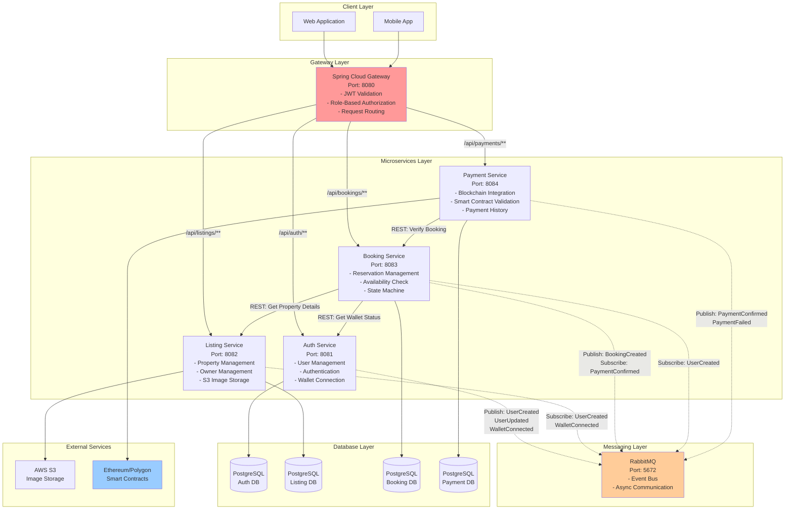

### 2.2 Description des composants

| Composant | Port | Responsabilités |
|-----------|------|-----------------|
| **Spring Cloud Gateway** | 8080 | - Point d'entrée unique<br/>- Authentification JWT<br/>- Autorisation basée sur les rôles<br/>- Routage intelligent<br/>- Injection du header `X-User-Id` |
| **Auth Service** | 8081 | - Gestion des utilisateurs (CRUD)<br/>- Authentification (Login/OTP)<br/>- Gestion des rôles (ADMIN, USER)<br/>- Gestion des types (HOST, CLIENT)<br/>- Connexion/déconnexion de wallet<br/>- Publication d'événements RabbitMQ |
| **Listing Service** | 8082 | - CRUD des propriétés<br/>- Gestion des propriétaires (Owner)<br/>- Workflow d'approbation (DRAFT → PENDING → APPROVED)<br/>- Upload d'images vers S3<br/>- Gestion des caractéristiques |
| **Booking Service** | 8083 | - Création de réservations<br/>- Vérification de disponibilité<br/>- Machine à états (PENDING → AWAITING_PAYMENT → CONFIRMED)<br/>- Snapshot des prix et wallets<br/>- Expiration automatique (15 min) |
| **Payment Service** | 8084 | - Validation des transactions blockchain<br/>- Interaction avec smart contracts<br/>- Vérification des événements on-chain<br/>- Historique des paiements<br/>- Publication d'événements de confirmation |

---

## 3. Modélisation des données (ERD Global)

### 3.1 Diagramme ERD complet

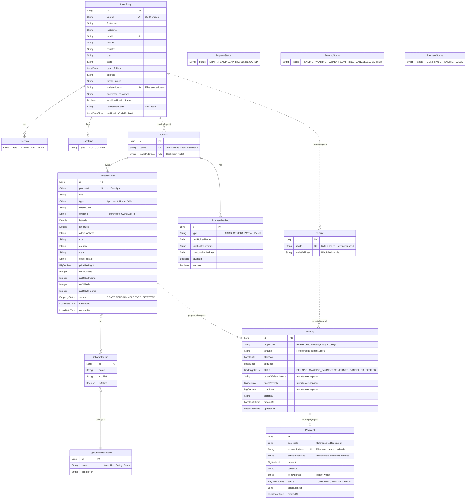

### 3.2 Relations logiques inter-services

Comme les microservices ont des bases de données séparées, les relations suivantes sont **logiques** (pas de clés étrangères SQL) :

| Service Source | Champ | Service Cible | Référence | Type |
|----------------|-------|---------------|-----------|------|
| Listing | `Owner.userId` | Auth | `UserEntity.userId` | String (UUID) |
| Booking | `Tenant.userId` | Auth | `UserEntity.userId` | String (UUID) |
| Booking | `Booking.propertyId` | Listing | `PropertyEntity.propertyId` | String (UUID) |
| Booking | `Booking.tenantId` | Auth | `UserEntity.userId` | String (UUID) |
| Payment | `Payment.bookingId` | Booking | `Booking.id` | Long |

### 3.3 Intégrité référentielle

- **Synchronisation via événements RabbitMQ:** Lorsqu'un utilisateur est créé dans Auth Service, un événement `UserCreated` est publié, permettant à Listing Service de créer un `Owner` et à Booking Service de créer un `Tenant`.
- **Validation via REST:** Avant de créer un booking, Booking Service vérifie l'existence de la propriété via un appel REST à Listing Service.
- **Pas de CASCADE DELETE:** Si un utilisateur est supprimé dans Auth Service, ses données dans les autres services restent intactes (à gérer manuellement ou via compensation).

---

## 4. Catalogue des API (Endpoints)

### 4.1 Auth Service (`/api/auth/**`)

#### Endpoints publics (Authentification)

| Méthode | Endpoint | Description | Authentification |
|---------|----------|-------------|------------------|
| POST | `/api/auth/users` | Inscription d'un nouvel utilisateur | ❌ Public |
| POST | `/api/auth/users/login` | Connexion (retourne JWT) | ❌ Public |
| POST | `/api/auth/users/verify-otp` | Vérification du code OTP | ❌ Public |
| POST | `/api/auth/users/resend-otp` | Renvoyer le code OTP | ❌ Public |
| POST | `/api/auth/users/forgot-password` | Mot de passe oublié | ❌ Public |
| POST | `/api/auth/users/reset-password` | Réinitialiser le mot de passe | ❌ Public |

#### Endpoints protégés (Gestion utilisateur)

| Méthode | Endpoint | Description | Rôles requis |
|---------|----------|-------------|--------------|
| GET | `/api/auth/users/{id}` | Récupérer un utilisateur | USER (propriétaire) |
| PUT | `/api/auth/users/{id}` | Mettre à jour un utilisateur | USER (propriétaire) |
| DELETE | `/api/auth/users/{id}` | Supprimer un utilisateur | ADMIN |

#### Gestion des agents (ADMIN uniquement)

| Méthode | Endpoint | Description | Rôles requis |
|---------|----------|-------------|--------------|
| POST | `/api/auth/users/admin/agents` | Créer un agent | ADMIN |
| GET | `/api/auth/users/admin/agents` | Lister tous les agents | ADMIN |
| DELETE | `/api/auth/users/admin/agents/{agentId}` | Supprimer un agent | ADMIN |

#### Gestion du wallet

| Méthode | Endpoint | Description | Rôles requis |
|---------|----------|-------------|--------------|
| POST | `/api/auth/users/{userId}/wallet/connect` | Connecter un wallet Ethereum | USER (propriétaire) |
| DELETE | `/api/auth/users/{userId}/wallet/disconnect` | Déconnecter le wallet | USER (propriétaire) |
| GET | `/api/auth/users/{userId}/wallet/status` | Statut du wallet | USER (propriétaire) |

---

### 4.2 Listing Service (`/api/listings/**`)

#### Propriétés (Properties)

| Méthode | Endpoint | Description | Rôles requis |
|---------|----------|-------------|--------------|
| GET | `/api/listings/properties` | Lister toutes les propriétés approuvées | ❌ Public |
| GET | `/api/listings/properties/{propertyId}` | Détails d'une propriété | ❌ Public |
| GET | `/api/listings/properties/my-properties` | Mes propriétés (propriétaire) | HOST |
| POST | `/api/listings/properties` | Créer une propriété (DRAFT) | HOST |
| PUT | `/api/listings/properties/{propertyId}` | Modifier une propriété | HOST (propriétaire) |
| DELETE | `/api/listings/properties/{propertyId}` | Supprimer une propriété | HOST (propriétaire) |
| POST | `/api/listings/properties/{propertyId}/images` | Ajouter des images (S3) | HOST (propriétaire) |
| DELETE | `/api/listings/properties/{propertyId}/images` | Supprimer des images | HOST (propriétaire) |

#### Workflow d'approbation (ADMIN)

| Méthode | Endpoint | Description | Rôles requis |
|---------|----------|-------------|--------------|
| GET | `/api/listings/properties/pending` | Propriétés en attente | ADMIN |
| GET | `/api/listings/properties/rejected` | Propriétés rejetées | ADMIN |
| POST | `/api/listings/properties/{propertyId}/submit` | Soumettre pour approbation | HOST (propriétaire) |
| POST | `/api/listings/properties/{propertyId}/approve` | Approuver une propriété | ADMIN |
| POST | `/api/listings/properties/{propertyId}/reject` | Rejeter une propriété | ADMIN |

#### Caractéristiques (Characteristics)

| Méthode | Endpoint | Description | Rôles requis |
|---------|----------|-------------|--------------|
| GET | `/api/listings/characteristics` | Lister toutes les caractéristiques | ❌ Public |
| GET | `/api/listings/characteristics/{id}` | Détails d'une caractéristique | ❌ Public |
| POST | `/api/listings/characteristics` | Créer une caractéristique | ADMIN |
| PUT | `/api/listings/characteristics/{id}` | Modifier une caractéristique | ADMIN |
| DELETE | `/api/listings/characteristics/{id}` | Supprimer une caractéristique | ADMIN |

#### Types de caractéristiques

| Méthode | Endpoint | Description | Rôles requis |
|---------|----------|-------------|--------------|
| GET | `/api/listings/type-caracteristiques` | Lister tous les types | ❌ Public |
| GET | `/api/listings/type-caracteristiques/{id}` | Détails d'un type | ❌ Public |
| POST | `/api/listings/type-caracteristiques` | Créer un type | ADMIN |

#### Propriétaires (Owners)

| Méthode | Endpoint | Description | Rôles requis |
|---------|----------|-------------|--------------|
| GET | `/api/listings/owners/check/{userId}` | Vérifier si un utilisateur est propriétaire | ❌ Public |
| GET | `/api/listings/owners/{userId}` | Détails d'un propriétaire | USER |
| GET | `/api/listings/owners` | Lister tous les propriétaires | ADMIN |

---

### 4.3 Booking Service (`/api/bookings/**`)

| Méthode | Endpoint | Description | Rôles requis |
|---------|----------|-------------|--------------|
| POST | `/api/bookings` | Créer une réservation (AWAITING_PAYMENT) | CLIENT |
| GET | `/api/bookings/my-bookings` | Mes réservations | USER |
| GET | `/api/bookings/{bookingId}` | Détails d'une réservation | USER (propriétaire) |
| PATCH | `/api/bookings/{bookingId}/cancel` | Annuler une réservation | USER (propriétaire) |
| GET | `/api/bookings/host/{userId}/future-count` | Nombre de réservations futures (hôte) | USER |
| GET | `/api/bookings/client/{userId}/active-count` | Nombre de réservations actives (client) | USER |

---

### 4.4 Payment Service (`/api/payments/**`)

| Méthode | Endpoint | Description | Rôles requis |
|---------|----------|-------------|--------------|
| POST | `/api/payments/validate` | Valider un paiement blockchain | CLIENT (propriétaire du booking) |
| GET | `/api/payments/booking/{bookingId}` | Historique des paiements d'un booking | USER (propriétaire) |
| GET | `/api/payments/health` | Health check | ❌ Public |

---

## 5. Workflows critiques (Diagrammes de séquence)

### 5.1 Scénario 1 : Inscription & Synchronisation

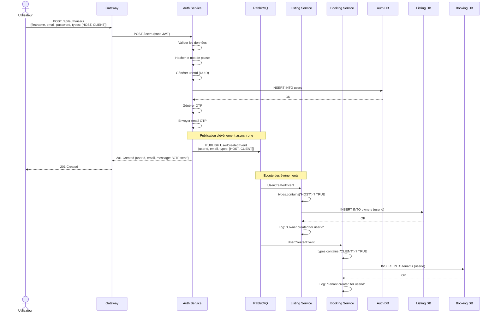

**Points clés:**
- **Événement unique, multiples consommateurs:** Un seul événement `UserCreatedEvent` est publié, mais Listing et Booking l'écoutent indépendamment.
- **Création conditionnelle:** Listing crée un `Owner` uniquement si `types` contient `HOST`, Booking crée un `Tenant` si `types` contient `CLIENT`.
- **Idempotence:** Si l'événement est rejoué, les services vérifient si l'entité existe déjà (contrainte `UNIQUE` sur `userId`).

---

### 5.2 Scénario 2 : Connexion de Wallet & Synchronisation

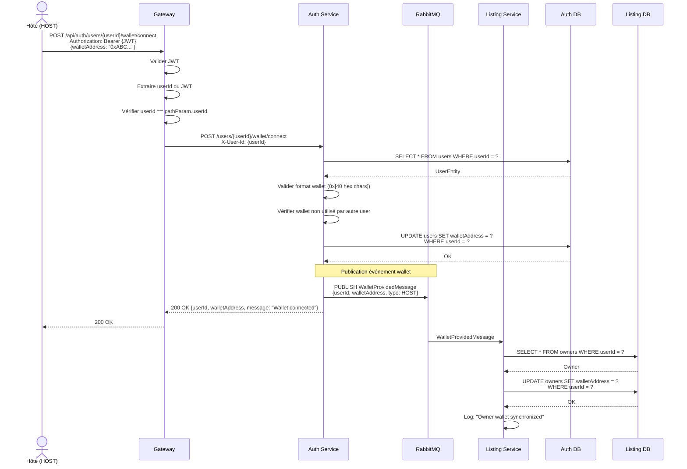

**Points clés:**
- **Validation stricte:** Auth Service vérifie que le wallet n'est pas déjà utilisé par un autre utilisateur.
- **Synchronisation automatique:** Listing Service met à jour la table `owners` dès réception de l'événement.
- **Type-aware:** L'événement contient le type d'utilisateur (HOST ou CLIENT) pour que les services sachent s'ils doivent réagir.

---

### 5.3 Scénario 3 : Création de Propriété & Workflow d'Approbation

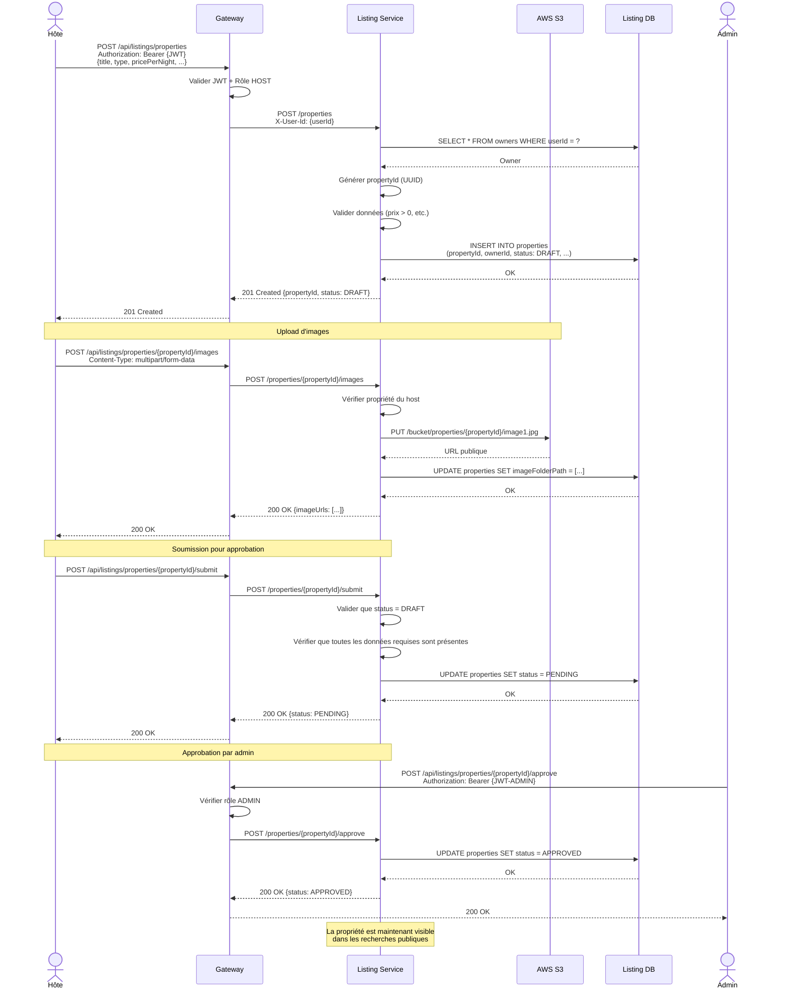

**Machine à états des propriétés:**
- **DRAFT:** Propriété en cours de création (non visible publiquement)
- **PENDING:** Soumise pour approbation (visible uniquement par l'admin)
- **APPROVED:** Approuvée et visible publiquement
- **REJECTED:** Rejetée par l'admin (peut être rééditée et resoumise)

---

### 5.4 Scénario 4 : Réservation & Paiement Blockchain (Workflow complet)

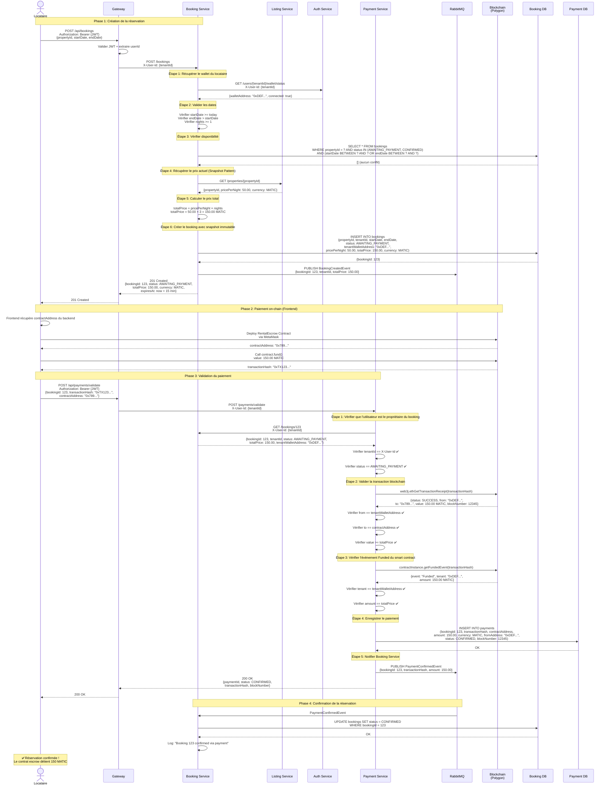

**Points critiques du workflow:**

1. **Snapshot immutable:** Le prix, le wallet et la devise sont figés lors de la création du booking (pattern "Immutable Contract"). Même si le prix de la propriété change ultérieurement, le booking conserve le prix d'origine.

2. **Timeout de 15 minutes:** Si aucun paiement n'est validé dans les 15 minutes, un scheduler automatique passe le booking en `EXPIRED` et libère la disponibilité.

3. **Validation multi-couches:**
    - **Sécurité:** Payment Service vérifie que l'utilisateur est bien le propriétaire du booking avant de valider.
    - **Blockchain:** Vérification de la transaction + de l'événement `Funded` du smart contract.
    - **Montant:** Vérification que le montant payé correspond au `totalPrice` du booking.

4. **Événements asynchrones:** Booking et Payment communiquent via RabbitMQ, ce qui permet de découpler les services et d'éviter les appels REST circulaires.

---

### 5.5 Scénario 5 : Annulation de Réservation (Cas d'erreur)

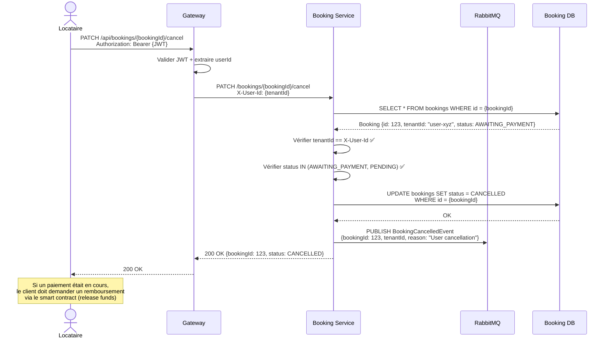

---

## 6. Sécurité et intégration

### 6.1 Authentification et autorisation

#### 6.1.1 Flux JWT

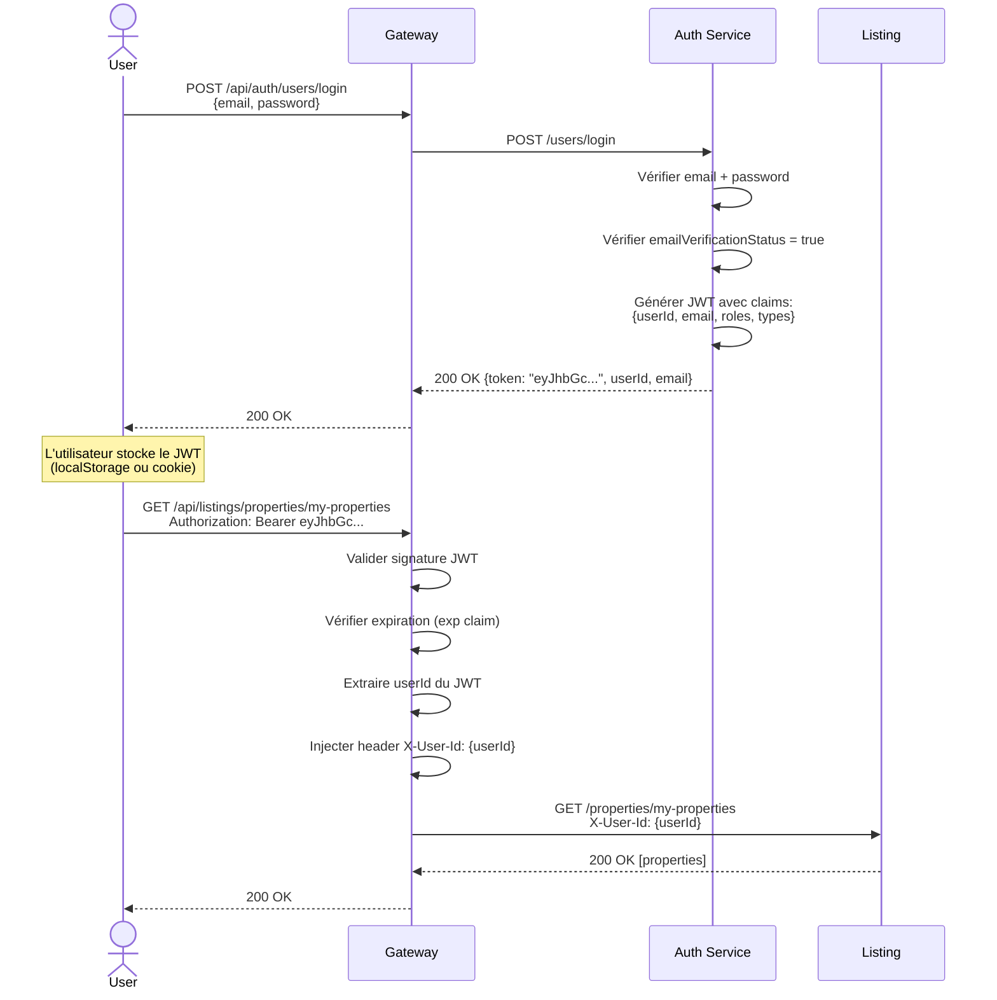

#### 6.1.2 Structure du JWT

```json
{
  "sub": "user-abc-123",
  "userId": "user-abc-123",
  "email": "john@example.com",
  "roles": ["USER"],
  "types": ["HOST", "CLIENT"],
  "iat": 1736869200,
  "exp": 1736955600
}
```

#### 6.1.3 Rôles et types

| Rôle | Description | Permissions |
|------|-------------|-------------|
| **ADMIN** | Administrateur système | - Approuver/rejeter propriétés<br/>- Créer/supprimer agents<br/>- Gérer caractéristiques<br/>- Accès à toutes les ressources |
| **USER** | Utilisateur standard | - Accès aux fonctionnalités de base<br/>- Limité à ses propres ressources |
| **AGENT** | Agent commercial | - Permissions intermédiaires (non implémenté) |

| Type | Description | Capacités |
|------|-------------|-----------|
| **HOST** | Propriétaire/Hôte | - Créer des propriétés<br/>- Recevoir des paiements via escrow |
| **CLIENT** | Locataire | - Réserver des propriétés<br/>- Effectuer des paiements |

**Note:** Un utilisateur peut avoir les deux types (`HOST` + `CLIENT`).

---

### 6.2 Validation de propriété

Le header `X-User-Id` injecté par la Gateway permet aux microservices de vérifier que l'utilisateur ne peut accéder qu'à ses propres ressources :

```java
// Exemple dans BookingController
@PatchMapping("/{bookingId}/cancel")
public ResponseEntity<BookingResponseDTO> cancelBooking(
        @PathVariable Long bookingId,
        @RequestHeader("X-User-Id") String tenantId
) {
    BookingResponseDTO booking = bookingService.getBookingById(bookingId);
    
    // ✅ SÉCURITÉ: Vérifier que l'utilisateur est le propriétaire
    if (!booking.getTenantId().equals(tenantId)) {
        log.warn("Unauthorized cancellation attempt by user {}", tenantId);
        return ResponseEntity.status(HttpStatus.FORBIDDEN).build();
    }
    
    bookingService.cancelBooking(bookingId);
    return ResponseEntity.ok(booking);
}
```

---

### 6.3 Circuit Breaker Pattern

Pour garantir la résilience face aux défaillances de services, Booking Service utilise **Resilience4j Circuit Breaker** :

```java
@CircuitBreaker(name = "listingService", fallbackMethod = "getPropertyFallback")
private PropertyDTO fetchPropertyPricing(String propertyId) {
    return listingServiceClient.getProperty(propertyId);
}

private PropertyDTO getPropertyFallback(String propertyId, Exception e) {
    log.error("❌ ListingService unavailable for property {}", propertyId);
    throw new ServiceUnavailableException(
        "Property service is temporarily unavailable. Please try again later."
    );
}
```

**États du Circuit Breaker:**
- **CLOSED:** Tout fonctionne normalement
- **OPEN:** Trop d'échecs → arrêt temporaire des appels (fallback automatique)
- **HALF_OPEN:** Test pour voir si le service est revenu

---

## 7. Communication inter-services

### 7.1 Patterns de communication

| Pattern | Technologie | Utilisation |
|---------|-------------|-------------|
| **Synchrone (REST)** | Spring Cloud OpenFeign | - Récupération de données en temps réel<br/>- Opérations nécessitant une réponse immédiate |
| **Asynchrone (Events)** | RabbitMQ | - Synchronisation de données<br/>- Notifications<br/>- Opérations non bloquantes |

---

### 7.2 Topologie RabbitMQ

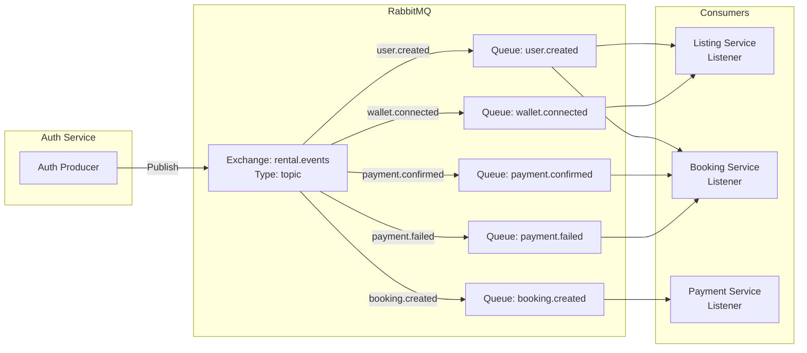

---

### 7.3 Événements RabbitMQ

#### 7.3.1 UserCreatedEvent

```json
{
  "userId": "user-abc-123",
  "email": "john@example.com",
  "firstname": "John",
  "lastname": "Doe",
  "types": ["HOST", "CLIENT"]
}
```

**Publishers:** Auth Service  
**Consumers:** Listing Service, Booking Service  
**Routing Key:** `user.created`

**Actions:**
- **Listing Service:** Crée un `Owner` si `types` contient `HOST`
- **Booking Service:** Crée un `Tenant` si `types` contient `CLIENT`

---

#### 7.3.2 WalletProvidedMessage

```json
{
  "userId": "user-abc-123",
  "walletAddress": "0xABC123...",
  "type": "HOST"
}
```

**Publishers:** Auth Service  
**Consumers:** Listing Service  
**Routing Key:** `wallet.connected`

**Actions:**
- **Listing Service:** Met à jour `Owner.walletAddress`

---

#### 7.3.3 BookingCreatedEvent

```json
{
  "bookingId": 123,
  "propertyId": "prop-xyz-789",
  "tenantId": "user-abc-123",
  "totalPrice": 150.00,
  "currency": "MATIC"
}
```

**Publishers:** Booking Service  
**Consumers:** Payment Service (optionnel, pour logs)  
**Routing Key:** `booking.created`

---

#### 7.3.4 PaymentConfirmedEvent

```json
{
  "bookingId": 123,
  "transactionHash": "0xTX123...",
  "contractAddress": "0x789...",
  "amount": 150.00,
  "currency": "MATIC",
  "blockNumber": 12345
}
```

**Publishers:** Payment Service  
**Consumers:** Booking Service  
**Routing Key:** `payment.confirmed`

**Actions:**
- **Booking Service:** Met à jour `Booking.status` de `AWAITING_PAYMENT` à `CONFIRMED`

---

#### 7.3.5 PaymentFailedEvent

```json
{
  "bookingId": 123,
  "reason": "Transaction reverted",
  "transactionHash": "0xTX123..."
}
```

**Publishers:** Payment Service  
**Consumers:** Booking Service  
**Routing Key:** `payment.failed`

**Actions:**
- **Booking Service:** Met à jour `Booking.status` à `CANCELLED`

---

### 7.4 Appels REST inter-services

| Service appelant | Service cible | Endpoint | Objectif |
|------------------|---------------|----------|----------|
| Booking | Listing | `GET /properties/{propertyId}` | Récupérer le prix actuel (snapshot) |
| Booking | Auth | `GET /users/{userId}/wallet/status` | Vérifier le wallet du locataire |
| Payment | Booking | `GET /bookings/{bookingId}` | Vérifier la validité du booking avant paiement |

**Note:** Ces appels sont protégés par des Circuit Breakers pour gérer les indisponibilités temporaires.

---

## 8. Intégration blockchain

### 8.1 Smart Contract: RentalEscrow

#### 8.1.1 Vue d'ensemble

Le contrat `RentalEscrow` est un contrat escrow décentralisé qui sécurise les paiements entre locataires et propriétaires. Chaque réservation (`Booking`) a son propre contrat déployé.

```solidity
// Pseudocode du contrat RentalEscrow
contract RentalEscrow {
    address public tenant;
    address public host;
    uint256 public amount;
    bool public funded;
    bool public completed;
    
    event Funded(address indexed tenant, uint256 amount);
    event Released(address indexed host, uint256 amount);
    
    constructor(address _tenant, address _host, uint256 _amount) {
        tenant = _tenant;
        host = _host;
        amount = _amount;
    }
    
    function fund() external payable {
        require(msg.sender == tenant, "Only tenant can fund");
        require(msg.value >= amount, "Insufficient amount");
        require(!funded, "Already funded");
        
        funded = true;
        emit Funded(msg.sender, msg.value);
    }
    
    function release() external {
        require(funded, "Not funded");
        require(!completed, "Already completed");
        require(msg.sender == tenant || msg.sender == host, "Unauthorized");
        
        completed = true;
        payable(host).transfer(amount);
        emit Released(host, amount);
    }
}
```

---

#### 8.1.2 Flux blockchain

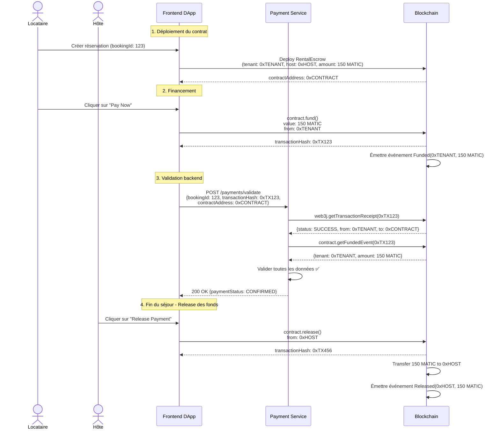

---

#### 8.1.3 Validation multi-couches

Le Payment Service effectue **3 niveaux de validation** :

1. **Validation de la transaction:**
    - Vérifier que `transaction.status == SUCCESS`
    - Vérifier que `transaction.from == tenantWalletAddress`
    - Vérifier que `transaction.to == contractAddress`

2. **Validation du montant:**
    - Vérifier que `transaction.value >= booking.totalPrice`

3. **Validation de l'événement smart contract:**
    - Récupérer l'événement `Funded` émis par le contrat
    - Vérifier que `event.tenant == tenantWalletAddress`
    - Vérifier que `event.amount >= booking.totalPrice`

---

### 8.2 Configuration Web3j

```java
@Configuration
public class Web3Config {
    
    @Value("${blockchain.rpc.url}")
    private String rpcUrl; // https://polygon-rpc.com
    
    @Value("${blockchain.chain.id}")
    private Long chainId; // 137 for Polygon Mainnet
    
    @Bean
    public Web3j web3j() {
        HttpService httpService = new HttpService(rpcUrl);
        return Web3j.build(httpService);
    }
    
    @Bean
    public Credentials credentials() {
        // Backend wallet pour déployer les contrats
        return Credentials.create("PRIVATE_KEY");
    }
}
```

---

## 9. Gestion des états et transitions

### 9.1 Machine à états: Booking

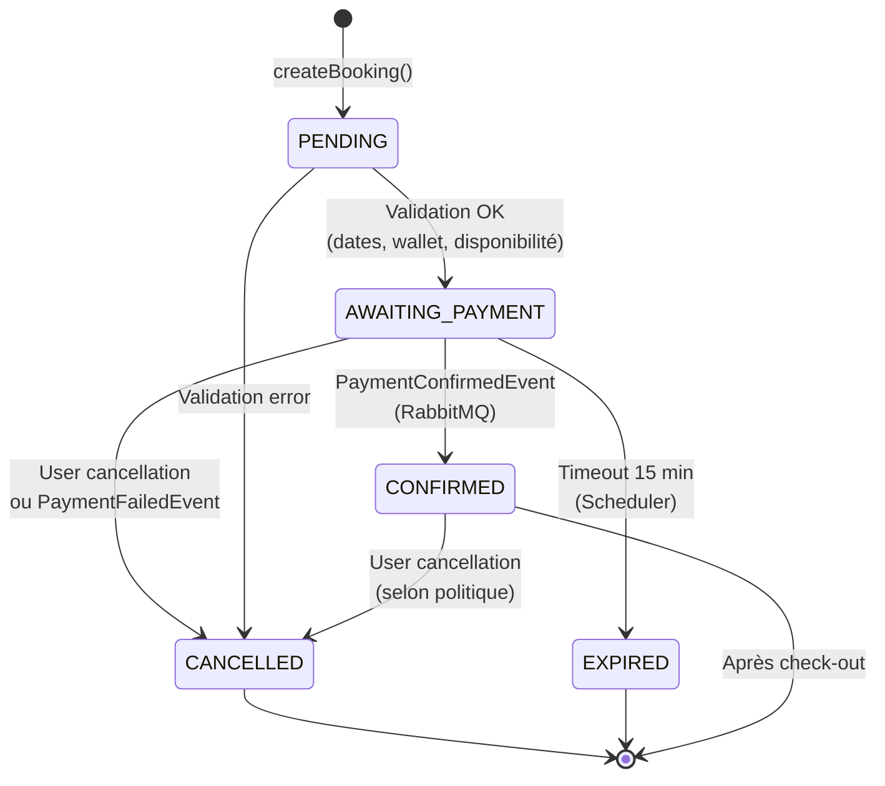

**Transitions:**
- **PENDING → AWAITING_PAYMENT:** Automatique si toutes les validations passent
- **AWAITING_PAYMENT → CONFIRMED:** Via événement RabbitMQ `PaymentConfirmedEvent`
- **AWAITING_PAYMENT → EXPIRED:** Via scheduler toutes les 5 minutes (vérifie `createdAt + 15 min < now`)
- **AWAITING_PAYMENT → CANCELLED:** Manuelle (utilisateur) ou via `PaymentFailedEvent`

---

### 9.2 Machine à états: Property

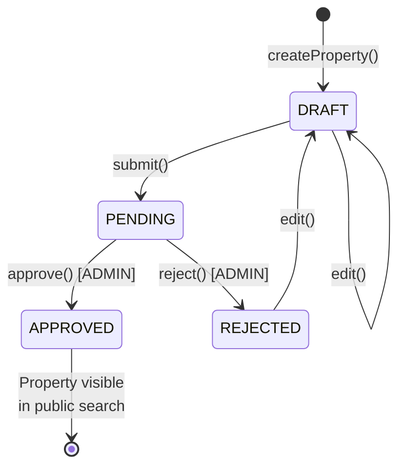

**Transitions:**
- **DRAFT → PENDING:** Lorsque l'hôte clique sur "Soumettre pour approbation"
- **PENDING → APPROVED:** Lorsque l'admin approuve la propriété
- **PENDING → REJECTED:** Lorsque l'admin rejette la propriété
- **REJECTED → DRAFT:** Lorsque l'hôte réédite la propriété rejetée

---

### 9.3 Machine à états: Payment

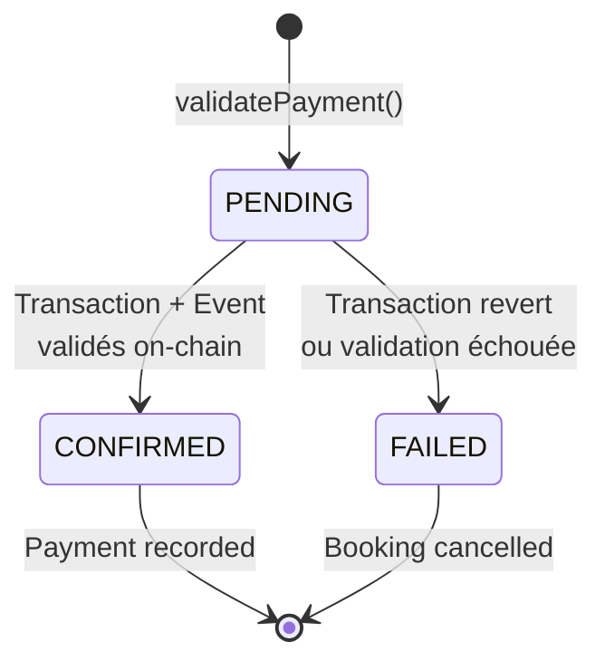

---

## 10. Patterns architecturaux

### 10.1 Database per Service

Chaque microservice possède **sa propre base de données PostgreSQL**, garantissant l'isolation et l'indépendance :

```
Auth Service     → auth_db
Listing Service  → listing_db
Booking Service  → booking_db
Payment Service  → payment_db
```

**Avantages:**
- Évolutivité indépendante
- Pas de couplage fort via FK
- Choix technologique libre par service

**Inconvénients:**
- Pas de transactions distribuées (gestion via Saga Pattern si nécessaire)
- Complexité de synchronisation (gérée via événements)

---

### 10.2 Event-Driven Architecture

Les microservices communiquent principalement via **événements RabbitMQ**, permettant un couplage faible :

```
Auth Service PUBLIE → UserCreatedEvent
  ↓
Listing Service ÉCOUTE → Crée Owner
Booking Service ÉCOUTE → Crée Tenant
```

**Avantages:**
- Découplage fort
- Résilience (pas de timeout)
- Extensibilité (ajout de consumers facile)

---

### 10.3 Saga Pattern (Simplifié)

Pour les workflows complexes comme la création de réservation + paiement, un **Saga orchestré** est implémenté :

1. **Booking Service** crée la réservation (AWAITING_PAYMENT)
2. **Payment Service** valide le paiement on-chain
3. Si succès → Publier `PaymentConfirmedEvent` → **Booking Service** confirme
4. Si échec → Publier `PaymentFailedEvent` → **Booking Service** annule

**Compensation automatique:** Si le paiement échoue, la réservation est automatiquement annulée (rollback logique).

---

### 10.4 Snapshot Pattern

Pour garantir l'**immutabilité des contrats**, le Booking Service prend un **snapshot** des données critiques au moment de la réservation :

```java
Booking booking = Booking.builder()
    .propertyId(request.getPropertyId())
    .tenantId(tenantId)
    .tenantWalletAddress(tenantWallet)  // ← Snapshot
    .pricePerNight(property.getPrice()) // ← Snapshot
    .totalPrice(totalPrice)             // ← Snapshot
    .currency(property.getCurrency())   // ← Snapshot
    .status(BookingStatus.AWAITING_PAYMENT)
    .build();
```

**Conséquences:**
- Si le prix de la propriété change ultérieurement, le booking conserve le prix d'origine.
- Si le locataire déconnecte son wallet, le booking conserve l'adresse d'origine.
- Le smart contract est déployé avec les valeurs exactes du snapshot.

---

### 10.5 Circuit Breaker Pattern

Implémenté via **Resilience4j** pour gérer les défaillances temporaires de services :

```yaml
# application.yml (Booking Service)
resilience4j:
  circuitbreaker:
    instances:
      listingService:
        registerHealthIndicator: true
        slidingWindowSize: 10
        minimumNumberOfCalls: 5
        failureRateThreshold: 50
        waitDurationInOpenState: 10s
```

**États:**
- **CLOSED:** Tout fonctionne (appels normaux)
- **OPEN:** Trop d'échecs → appels bloqués (fallback immédiat)
- **HALF_OPEN:** Test pour voir si le service est revenu

---

## 11. Déploiement et infrastructure

### 11.1 Architecture de déploiement

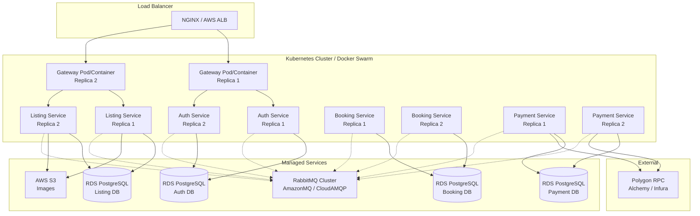

---

### 11.2 Variables d'environnement (Exemple: Booking Service)

```properties
# Database
spring.datasource.url=jdbc:postgresql://booking-db.amazonaws.com:5432/booking_db
spring.datasource.username=${DB_USERNAME}
spring.datasource.password=${DB_PASSWORD}

# RabbitMQ
spring.rabbitmq.host=${RABBITMQ_HOST}
spring.rabbitmq.port=${RABBITMQ_PORT}
spring.rabbitmq.username=${RABBITMQ_USERNAME}
spring.rabbitmq.password=${RABBITMQ_PASSWORD}

# Service URLs
listing.service.url=${LISTING_SERVICE_URL}
auth.service.url=${AUTH_SERVICE_URL}

# Circuit Breaker
resilience4j.circuitbreaker.instances.listingService.failureRateThreshold=50
```

---

### 11.3 Health checks et monitoring

Chaque service expose un endpoint de health check :

```java
@RestController
@RequestMapping("/actuator")
public class HealthController {
    
    @GetMapping("/health")
    public ResponseEntity<String> health() {
        return ResponseEntity.ok("Service is healthy");
    }
}
```

**Monitoring recommandé:**
- **Prometheus + Grafana:** Métriques applicatives
- **ELK Stack:** Logs centralisés
- **Jaeger / Zipkin:** Distributed tracing
- **AWS CloudWatch:** Infrastructure monitoring

---

### 11.4 Dockerfile (Exemple)

```dockerfile
FROM openjdk:17-jdk-slim
WORKDIR /app
COPY target/booking-service-0.0.1-SNAPSHOT.jar app.jar
EXPOSE 8083
ENTRYPOINT ["java", "-jar", "app.jar"]
```

---

### 11.5 Docker Compose (Développement local)

```yaml
version: '3.8'

services:
  gateway:
    build: ./gateway
    ports:
      - "8080:8080"
    environment:
      AUTH_SERVICE_URL: http://auth-service:8081
      LISTING_SERVICE_URL: http://listing-service:8082
      BOOKING_SERVICE_URL: http://booking-service:8083
      PAYMENT_SERVICE_URL: http://payment-service:8084
    depends_on:
      - auth-service
      - listing-service
      - booking-service
      - payment-service

  auth-service:
    build: ./auth-service
    ports:
      - "8081:8081"
    environment:
      DB_URL: jdbc:postgresql://auth-db:5432/auth_db
      RABBITMQ_HOST: rabbitmq
    depends_on:
      - auth-db
      - rabbitmq

  listing-service:
    build: ./listing-service
    ports:
      - "8082:8082"
    environment:
      DB_URL: jdbc:postgresql://listing-db:5432/listing_db
      RABBITMQ_HOST: rabbitmq
      AWS_S3_BUCKET: rental-app-images
    depends_on:
      - listing-db
      - rabbitmq

  booking-service:
    build: ./booking-service
    ports:
      - "8083:8083"
    environment:
      DB_URL: jdbc:postgresql://booking-db:5432/booking_db
      RABBITMQ_HOST: rabbitmq
      LISTING_SERVICE_URL: http://listing-service:8082
      AUTH_SERVICE_URL: http://auth-service:8081
    depends_on:
      - booking-db
      - rabbitmq

  payment-service:
    build: ./payment-service
    ports:
      - "8084:8084"
    environment:
      DB_URL: jdbc:postgresql://payment-db:5432/payment_db
      RABBITMQ_HOST: rabbitmq
      BLOCKCHAIN_RPC_URL: https://polygon-rpc.com
      BOOKING_SERVICE_URL: http://booking-service:8083
    depends_on:
      - payment-db
      - rabbitmq

  auth-db:
    image: postgres:15
    environment:
      POSTGRES_DB: auth_db
      POSTGRES_USER: postgres
      POSTGRES_PASSWORD: postgres
    volumes:
      - auth-db-data:/var/lib/postgresql/data

  listing-db:
    image: postgres:15
    environment:
      POSTGRES_DB: listing_db
      POSTGRES_USER: postgres
      POSTGRES_PASSWORD: postgres
    volumes:
      - listing-db-data:/var/lib/postgresql/data

  booking-db:
    image: postgres:15
    environment:
      POSTGRES_DB: booking_db
      POSTGRES_USER: postgres
      POSTGRES_PASSWORD: postgres
    volumes:
      - booking-db-data:/var/lib/postgresql/data

  payment-db:
    image: postgres:15
    environment:
      POSTGRES_DB: payment_db
      POSTGRES_USER: postgres
      POSTGRES_PASSWORD: postgres
    volumes:
      - payment-db-data:/var/lib/postgresql/data

  rabbitmq:
    image: rabbitmq:3-management
    ports:
      - "5672:5672"
      - "15672:15672"
    environment:
      RABBITMQ_DEFAULT_USER: guest
      RABBITMQ_DEFAULT_PASS: guest
    volumes:
      - rabbitmq-data:/var/lib/rabbitmq

volumes:
  auth-db-data:
  listing-db-data:
  booking-db-data:
  payment-db-data:
  rabbitmq-data:
```

---

## Conclusion

Cette documentation présente l'architecture complète de la **Decentralized Rental App**, un système de location immobilière décentralisé basé sur une architecture microservices moderne. Les points forts du système incluent :

✅ **Modularité:** 4 microservices indépendants avec isolation complète des bases de données  
✅ **Sécurité:** Authentification JWT + validation stricte de la propriété des ressources  
✅ **Résilience:** Circuit Breakers pour gérer les défaillances temporaires  
✅ **Décentralisation:** Paiements sécurisés via smart contracts Ethereum  
✅ **Event-Driven:** Communication asynchrone via RabbitMQ pour un découplage fort  
✅ **Immutabilité:** Snapshot Pattern pour garantir la stabilité des contrats  
✅ **Workflow robuste:** Machines à états claires pour les réservations et propriétés

Le système est conçu pour être **scalable**, **maintenable** et **évolutif**, tout en respectant les meilleures pratiques des architectures microservices et de la blockchain.

---

**Auteur:** Architecte Logiciel Senior  
**Date:** 14 janvier 2026  
**Version:** 1.0  
**Projet:** Decentralized Rental App
## Cloud Infrastructure & AI

(To be completed by the Cloud Engineer & AI Engineer)

## DevOps & Deployment

(To be completed by the DevOps Engineer)

## Team Roles & Responsibilities

Backend Engineer : MEHDI LAGHRISSI
Blockchain & Smart Contract Engineer : DOUAA BAHADDOU
Frontend Engineer (React) : IBRAHIM ZAYROUH
Cloud Engineer & AI	: ERRAOUDI ABDESSAMAD
DevOps Engineer :	LAFDIL NOHAYLA