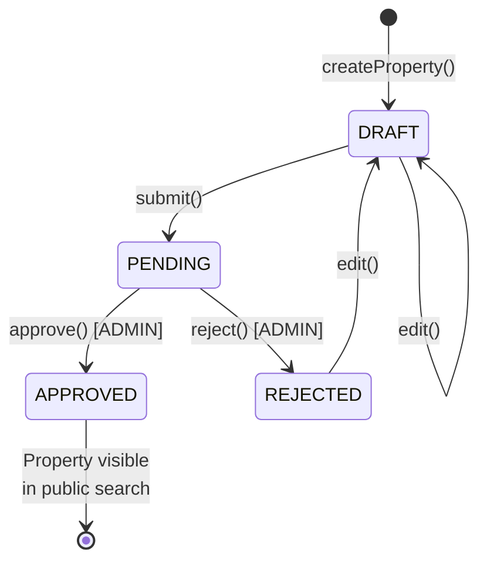

### 9.2 Machine à états: Property

**Transitions:**
- **DRAFT → PENDING:** Lorsque l'hôte clique sur "Soumettre pour approbation"
- **PENDING → APPROVED:** Lorsque l'admin approuve la propriété
- **PENDING → REJECTED:** Lorsque l'admin rejette la propriété
- **REJECTED → DRAFT:** Lorsque l'hôte réédite la propriété rejetée
